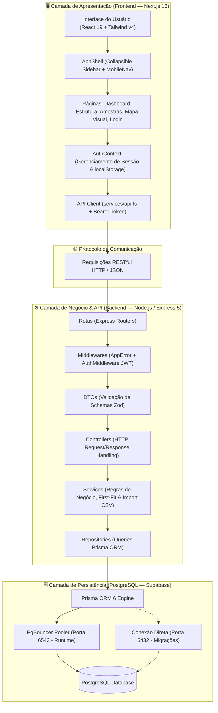
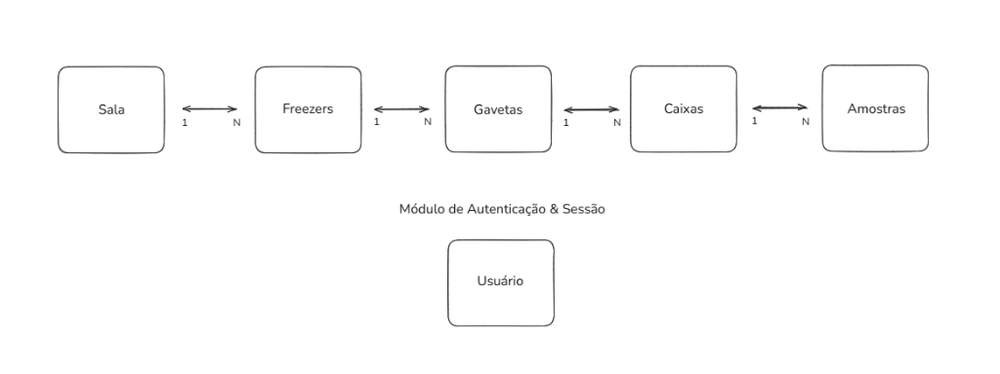
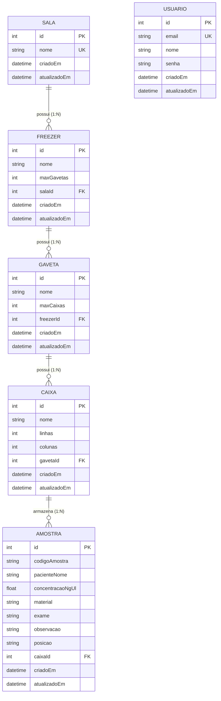

# 🏛️ Arquitetura do Sistema e Modelo de Banco de Dados

> Especificação técnica detalhada da arquitetura Fullstack do projeto NeoGenomica, englobando a topologia de componentes, o diagrama de entidade-relacionamento (ERD), cardinalidades, regras de integridade e o fluxo físico de dados da aplicação.

---

## 📑 Índice

1. [Visão Geral da Arquitetura (End-to-End)](#1-visão-geral-da-arquitetura-end-to-end)
2. [Diagrama da Arquitetura do Sistema](#2-diagrama-da-arquitetura-do-sistema)
3. [Modelo de Banco de Dados (ERD Diagram)](#3-modelo-de-banco-de-dados-erd-diagram)
4. [Especificação das Tabelas e Atributos](#4-especificação-das-tabelas-e-atributos)
5. [Relacionamentos e Regras de Integridade](#5-relacionamentos-e-regras-de-integridade)
6. [Decisões de Modelagem e Algoritmos](#6-decisões-de-modelagem-e-algoritmos)

---

## 1. Visão Geral da Arquitetura (End-to-End)

A aplicação é dividida em **camadas bem desacopladas**, seguindo o padrão cliente-servidor RESTful. A comunicação ocorre de forma assíncrona utilizando JSON sobre HTTP/HTTPS com tokens de autenticação **JWT (JSON Web Tokens)**.

```
┌─────────────────┐       HTTP / REST (JSON)       ┌─────────────────┐       Prisma ORM        ┌─────────────────┐
│                 │ ─────────────────────────────> │                 │ ──────────────────────> │                 │
│  Client React   │                                │  Express API    │                         │  PostgreSQL     │
│  (Next.js 16)   │ <───────────────────────────── │  (Node.js 20)   │ <────────────────────── │  (Supabase)     │
└─────────────────┘      Header: Bearer <token>    └─────────────────┘    PgBouncer / Direct   └─────────────────┘
```

---

## 2. Diagrama da Arquitetura do Sistema



---

## 3. Modelo de Banco de Dados (ERD Diagram)

A estrutura do banco de dados reflete a **hierarquia física real do laboratório de genômica**, estabelecendo uma cadeia estrita de contenção: uma **Sala** contém **Freezers**, que contêm **Gavetas**, que contêm **Caixas**, que contêm **Amostras (Microtubos)**.

### 🎨 Diagrama de Planejamento dos Relacionamentos


> **Nota de Arquitetura sobre a entidade `Usuário`**:
> Como demonstrado no planejamento acima, o módulo de **Autenticação e Sessão (`Usuário`)** é desacoplado da hierarquia biológica do laboratório. A tabela `usuarios` opera de forma autônoma para emissão e validação de tokens JWT. Caso a camada de autenticação seja desativada, a integridade referencial do banco (`Sala ➔ Freezer ➔ Gaveta ➔ Caixa ➔ Amostra`) permanece 100% preservada.

---

### 🗺️ Diagrama ERD Interativo em Mermaid



---

## 4. Especificação das Tabelas e Atributos

### 1. Tabela `salas` (Salas Físicas)
Armazena os compartimentos/salas físicas do laboratório (ex: *"Pré"*, *"Pós"*, *"Extração"*).

| Campo | Tipo | Nulo? | Descrição / Regra |
|---|---|---|---|
| `id` | `Int` | ❌ Não | Chave Primária (`Autoincrement`) |
| `nome` | `String` | ❌ Não | Nome da sala — **Único (`@unique`)** |
| `criadoEm` | `DateTime` | ❌ Não | Timestamp de criação (`now()`) |
| `atualizadoEm` | `DateTime` | ❌ Não | Timestamp de atualização (`updatedAt`) |

### 2. Tabela `freezers` (Equipamentos de Refrigeração)
Armazena os freezers localizados em uma sala (ex: *"-20C (Amostras)"*, *"-80C Extração"*).

| Campo | Tipo | Nulo? | Descrição / Regra |
|---|---|---|---|
| `id` | `Int` | ❌ Não | Chave Primária |
| `nome` | `String` | ❌ Não | Nome do freezer |
| `maxGavetas` | `Int` | ⚠️ Sim | Limite opcional de gavetas suportadas |
| `salaId` | `Int` | ❌ Não | Chave Estrangeira ➔ `salas.id` |

### 3. Tabela `gavetas` (Divisórias do Freezer)
Armazena as gavetas ou racks presentes dentro de um freezer (ex: *"Gaveta 1"*, *"Gaveta 2"*).

| Campo | Tipo | Nulo? | Descrição / Regra |
|---|---|---|---|
| `id` | `Int` | ❌ Não | Chave Primária |
| `nome` | `String` | ❌ Não | Nome da gaveta |
| `maxCaixas` | `Int` | ⚠️ Sim | Limite opcional de caixas suportadas |
| `freezerId` | `Int` | ❌ Não | Chave Estrangeira ➔ `freezers.id` |

### 4. Tabela `caixas` (Grades de Armazenamento)
Armazena as caixas onde ficam localizados os microtubos. Define as dimensões do grid ($N \times M$).

| Campo | Tipo | Nulo? | Descrição / Regra |
|---|---|---|---|
| `id` | `Int` | ❌ Não | Chave Primária |
| `nome` | `String` | ❌ Não | Nome da caixa (ex: *"CONTROLE INTERNO"*) |
| `linhas` | `Int` | ❌ Não | Número de linhas da grade (ex: `10`) |
| `colunas` | `Int` | ❌ Não | Número de colunas da grade (ex: `10`) |
| `gavetaId` | `Int` | ❌ Não | Chave Estrangeira ➔ `gavetas.id` |

### 5. Tabela `amostras` (Microtubos de DNA/Swab/Sangue)
Armazena a informação biológica e a localização física exata da amostra na caixa.

| Campo | Tipo | Nulo? | Descrição / Regra |
|---|---|---|---|
| `id` | `Int` | ❌ Não | Chave Primária |
| `codigoAmostra` | `String` | ⚠️ Sim | Código identificador (pode ser nulo para controles) |
| `pacienteNome` | `String` | ❌ Não | Nome do paciente ou identificador da amostra |
| `concentracaoNgUl` | `Float` | ⚠️ Sim | Concentração em $ng/\mu L$ |
| `material` | `String` | ❌ Não | Tipo do material biológico (`DNA`, `Swab`, `Sangue`) |
| `exame` | `String` | ⚠️ Sim | Nome do exame associado |
| `observacao` | `String` | ⚠️ Sim | Observações adicionais |
| `posicao` | `String` | ❌ Não | Posição no grid da caixa (ex: `"A1"`, `"C5"`, `"J10"`) |
| `caixaId` | `Int` | ❌ Não | Chave Estrangeira ➔ `caixas.id` |

### 6. Tabela `usuarios` (Autenticação de Usuários)
Tabela independente usada exclusivamente para autenticação JWT e controle de acesso.

| Campo | Tipo | Nulo? | Descrição / Regra |
|---|---|---|---|
| `id` | `Int` | ❌ Não | Chave Primária |
| `email` | `String` | ❌ Não | Email do usuário — **Único (`@unique`)** |
| `nome` | `String` | ❌ Não | Nome completo do usuário |
| `senha` | `String` | ❌ Não | Hash criptográfico bcrypt da senha |

---

## 5. Relacionamentos e Regras de Integridade

### Deleção em Cascata (`onDelete: Cascade`)
Toda a hierarquia do laboratório foi configurada no Prisma Schema com a regra `onDelete: Cascade`.

- Ao deletar uma **Sala**, o banco remove automaticamente todas os seus **Freezers** ➔ **Gavetas** ➔ **Caixas** ➔ **Amostras**.
- Ao deletar uma **Caixa**, todas as **Amostras** nela contidas são removidas de forma consistente.

```prisma
// Exemplo de configuração relacional no Prisma Schema
model Freezer {
  id      Int      @id @default(autoincrement())
  salaId  Int
  sala    Sala     @relation(fields: [salaId], references: [id], onDelete: Cascade)
  gavetas Gaveta[]
}
```

---

## 6. Decisões de Modelagem e Algoritmos

### 1. Posições Calculadas Dinamicamente (sem tabela `Posicao`)
Em vez de criar uma tabela com centenas de linhas estáticas para cada coordenada de célula, a posição (ex: `"A1"`, `"B5"`) é salva como uma `String` direta na tabela `Amostra`. As posições válidas e a grade $N \times M$ são calculadas **dinamicamente** em memória com base no total de `linhas` e `colunas` da caixa.

### 2. Algoritmo First-Fit de Alocação
O endpoint `/amostras/sugerir-posicao` executa a busca determinística de vagas livres:
1. Busca todas as caixas ordenadas por `criadoEm ASC`.
2. Para cada caixa, gera a sequência de posições (`A1`, `A2` ... `J10`).
3. Carrega as posições ocupadas em uma estrutura `Set<string>` (busca de complexidade $O(1)$).
4. Retorna a primeira vaga voga e o caminho físico completo.

---

*Documentação gerada em: 2026-08-11 — Arquitetura & Modelo de Dados v1.0.0*
