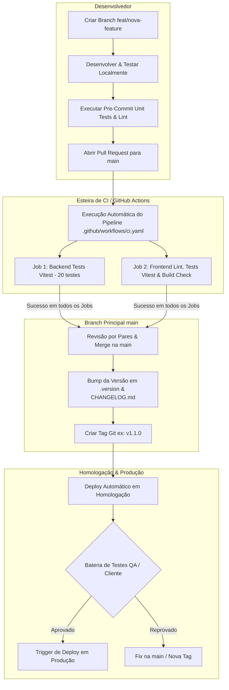

# 🔄 Fluxo de Desenvolvimento e Git Flow (Desafio 2)

> Este documento descreve o fluxo de desenvolvimento, gerenciamento de branches, estratégia de GitFlow, versionamento semântico (SemVer), processo de release, homologação, hotfix e rollback do projeto NeoGenomica.

---

## 📐 Estrutura do Git Flow

O projeto adota uma variação simplificada do [GitLab Flow](https://docs.gitlab.com/ee/topics/gitlab_flow.html#environment-branches-with-gitlab-flow), adequada para entregas contínuas com ambientes bem definidos (**Desenvolvimento**, **Homologação** e **Produção**).

```
feature/1 ──(PR)──> GitHub Actions CI ──(Merge)──> main ──(Tag SemVer)──> Homologação ──(Aprovação)──> Produção
```

---

## 📊 Diagrama do Fluxo (Workflow)



> 📄 **Especificação Técnica da Esteira de CI/CD**: Para visualizar os detalhes da configuração do YAML, jobs, steps e política de cache, acesse [`Pipeline-CI-CD.md`](./Pipeline-CI-CD.md).
> 📄 **Arquivo do Desenho de Arquitetura**: O diagrama original em alta resolução foi construído no Excalidraw e está disponível em [`docs/Neogenomica.excalidraw`](./Neogenomica.excalidraw).

---

## 🚀 Etapas do Fluxo de Trabalho

### 1. Desenvolvimento de Features (`feat/*` / `fix/*`)
- Nenhuma alteração é feita diretamente nas branches protegidas.
- O desenvolvedor cria uma branch a partir da `main` (ex: `feat/menu-mobile` ou `fix/login-redirect`).
- **Validação Local (Pre-commit)**: Antes do commit, os hooks do Git validam automaticamente a suíte de 41 testes unitários (Vitest) e o linter (ESLint).
- **Validação Remota na Nuvem (GitHub Actions CI)**: Ao abrir o **Pull Request (PR)**, o workflow `.github/workflows/ci.yaml` é disparado automaticamente em containers Linux isolados (`ubuntu-latest`), garantindo que os testes passem na nuvem antes de permitir o merge na `main`.

### 2. Versionamento Semântico (SemVer) e Releases
Toda nova funcionalidade ou correção gera uma nova versão seguindo o padrão **[SemVer](https://semver.org/)** (`MAJOR.MINOR.PATCH`):
- **MAJOR** (`1.0.0` -> `2.0.0`): Mudanças incompatíveis com versões anteriores (breaking changes).
- **MINOR** (`1.0.0` -> `1.1.0`): Novas funcionalidades mantendo compatibilidade.
- **PATCH** (`1.0.0` -> `1.0.1`): Correções de bugs (bugfixes e hotfixes).

Ao preparar uma release:
1. Atualiza-se o arquivo `.version` com a versão da release.
2. Registram-se todas as mudanças no arquivo `CHANGELOG.md` (padrão [Keep a Changelog](https://keepachangelog.com/)).
3. Cria-se a tag Git correspondente (ex: `git tag -a v1.1.0 -m "Release v1.1.0"`).

### 3. Deploy em Homologação e Produção
- **Homologação**: A criação de uma nova tag dispara automaticamente o pipeline de build e deploy no ambiente de **Homologação** (Staging).
- **Produção**: Após a validação da bateria de testes funcionais e aprovação das partes interessadas, o deploy é promovido para o ambiente de **Produção**.

---

## 🛠️ Procedimentos Especiais

### 🔄 Rollback
Caso ocorra qualquer instabilidade imprevista no ambiente de produção:
1. O *rollback* **nunca exige reescrever o código** sob pressão.
2. Basta selecionar a **tag de versão estável anterior** (ex: `v1.0.0`) na esteira de CI/CD e re-disparar o fluxo de deploy.
3. O ambiente de produção é restaurado instantaneamente para o estado seguro e testado anteriormente.

### 🚑 Hotfix
Para corrigir um erro crítico em produção:
1. Uma branch de correção é criada a partir da `main`.
2. A correção é aplicada, testada localmente e submetida a um PR validado pelo **GitHub Actions CI**.
3. Incrementa-se a versão **PATCH** (ex: `1.1.0` -> `1.1.1`) no `.version` e `CHANGELOG.md`.
4. Uma nova tag é gerada, disparando o deploy para Homologação e imediatamente para Produção após a validação do fix.

---

## 💡 Decisões de Arquitetura & Motivações

- **Defesa em Duas Camadas**: O `pre-commit` local serve para *feedback* rápido ao desenvolvedor. O **GitHub Actions CI** atua como o portão de segurança inegociável do repositório remoto, impedindo merges quebrados mesmo se a verificação local for ignorada. (Veja detalhes em [`Pipeline-CI-CD.md`](./Pipeline-CI-CD.md)).
- **Simplificação e Agilidade**: A adoção do GitLab Flow simplificado reduz os conflitos de merge (*merge hells*) comuns do GitFlow tradicional (que mantém branches `develop` e `release` de vida longa separadas por meses).
- **Entregáveis Claros**: Cada tag criada representa um entregável estável, auditável e documentado para a equipe e para o cliente final.
