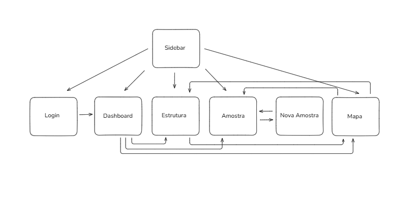

# 📖 Frontend — Documentação Completa

> Este documento contém toda a especificação técnica do frontend NeoGenomica:
> arquitetura em camadas, design system, serviços de API, autenticação, estrutura de páginas, responsividade mobile e suíte de testes unitários.

---

## 📑 Índice

1. [Stack e Dependências](#1-stack-e-dependências)
2. [Design System e Estilização](#2-design-system-e-estilização)
3. [Estrutura de Pastas](#3-estrutura-de-pastas)
4. [Camada de Serviços e API (`services/`)](#4-camada-de-serviços-e-api-services)
5. [Autenticação e Estado Global (`AuthContext`)](#5-autenticação-e-estado-global-authcontext)
6. [Estrutura das Páginas e Componentes](#6-estrutura-das-páginas-e-componentes)
7. [Responsividade e Layout Híbrido (Desktop vs Mobile)](#7-responsividade-e-layout-híbrido-desktop-vs-mobile)
8. [Suíte de Testes Unitários e CI/CD](#8-suíte-de-testes-unitários-e-cicd)

---

## 1. Stack e Dependências

### Core & Framework
- **Next.js 16 (App Router)**: Framework React para roteamento e renderização de alta performance.
- **React 19**: Biblioteca UI com suporte a Server/Client Components e hooks modernos.
- **TypeScript 5**: Tipagem estática rigorosa para previdência de erros de contrato e prop-drilling.

### Estilização & UI
- **Tailwind CSS 4**: Estilização com design tokens em `@theme` (`globals.css`), sem frameworks de UI externos.
- **Montserrat**: Tipografia do Google Fonts aplicada globalmente (`--font-montserrat`).

### Testes & Qualidade
- **Vitest 4**: Runner de testes unitários ultrarrápido integrado com Vite/Next.js.
- **React Testing Library & jsdom**: Simulação de ambiente DOM para asserção de componentes e eventos de usuário.
- **ESLint 9**: Análise estática de código com regras estritas para React 19 e Next.js.
- **Pre-commit Hooks**: Automação Git que executa testes unitários e linter antes de cada commit.

---

## 2. Design System e Estilização

O design system da aplicação foi construído em Vanilla CSS + Tailwind v4 tokens no arquivo `app/globals.css`, garantindo uma identidade visual limpa, corporativa e profissional.

### Paleta de Cores Oficial

| Token | Hexadecimal | Utilização no Sistema |
|---|---|---|
| `--color-neo-darkest` | `#041D30` | Modais, tooltips, cards de destaque e texto principal |
| `--color-neo-darker` | `#071928` | Fundo do Sidebar |
| `--color-neo-dark` | `#0B2A44` | Avatares, badges de DNA e hovers de navegação |
| `--color-neo-teal-dark` | `#075F69` | Hover de acento e bordas escuras |
| `--color-neo-teal` | `#0098AE` | Cor de acento principal (botões, ativadores, links) |
| `--color-neo-light` | `#DFF2F3` | Fundo de badges, banners de aviso e highlights |
| `--color-neo-lighter` | `#EAF2F5` | Fundo geral da aplicação e containers |

### Micro-animações CSS
- `.animate-fade-in`: Transição suave de entrada das páginas (`opacity` e `translateY(8px)`).
- `.animate-scale-in`: Efeito de elevação ao abrir modais (`scale(0.96) -> scale(1)`).
- `.animate-spin`: Animação de rotação contínua para spinners de carregamento.

---

## 3. Estrutura de Pastas

```
frontend/devtest-frontend/
├── app/                      # Rotas do Next.js (App Router)
│   ├── (main)/               # Grupo de rotas protegidas (com AppShell)
│   │   ├── page.tsx          # Dashboard Inicial (/)
│   │   ├── estrutura/        # Gestão Física (Salas, Freezers, Gavetas, Caixas)
│   │   ├── amostras/         # Listagem, Filtros e Importação CSV
│   │   │   └── nova/         # Cadastro de Amostra com First-Fit
│   │   └── caixas/[id]/mapa/ # Mapa Visual em Grade N x M
│   ├── login/                # Página de Autenticação (Split-card)
│   ├── layout.tsx            # RootLayout com AuthProvider e Metadata
│   └── globals.css           # Design Tokens, Animações e Scrollbars
│
├── components/               # Componentes React Reutilizáveis
│   ├── ui/                   # Design System básico (Button, Input, Select, Modal, Badge, StatCard...)
│   ├── layout/               # AppShell, Sidebar (Collapsible), Header, MobileNav
│   ├── estrutura/            # Modais de CRUD da hierarquia física
│   ├── amostras/             # Filtros, Modal de Edição e ImportCSVModal
│   ├── nova-amostra/         # SugestaoCard (Card visual do First-Fit)
│   └── mapa/                 # BoxGrid, BoxCell e AmostraDetailModal
│
├── services/                 # Comunicação HTTP e Regras de Consumo de API
│   ├── api.ts                # Fetcher base (JWT Header Injection, ApiError, Upload)
│   ├── auth.service.ts
│   ├── sala.service.ts
│   ├── freezer.service.ts
│   ├── gaveta.service.ts
│   ├── caixa.service.ts
│   └── amostra.service.ts
│
├── contexts/
│   └── AuthContext.tsx       # Contexto Global de Autenticação e Proteção de Rotas
│
├── types/
│   └── index.ts              # Interfaces TypeScript compartilhadas
│
└── __tests__/                # Suíte de Testes Unitários (Vitest)
    ├── components/           # Testes de Componentes UI (Button, Badge, Input, Modal, SugestaoCard)
    └── services/             # Testes da camada HTTP e API
```

---

## 4. Camada de Serviços e API (`services/`)

A camada de serviços centraliza todas as chamadas HTTP para o backend Express.

### Cliente HTTP Base (`services/api.ts`)
- **Injeção de JWT**: Adiciona automaticamente o cabeçalho `Authorization: Bearer <token>` em todas as requisições caso o token esteja presente no `localStorage`.
- **Tratamento Uniforme de Erros**: Converte falhas HTTP em instâncias da classe `ApiError`, contendo a mensagem vinda da API e o código de status HTTP (ex: 401, 404, 409).
- **Suporte a Upload Multipart**: Método `upload<T>()` dedicado para o envio de arquivos CSV via `FormData`.

### Mapeamento dos Serviços

| Serviço | Métodos Disponíveis | Descrição |
|---|---|---|
| `auth.service.ts` | `login`, `register`, `getMe`, `logout` | Autenticação de usuário e controle de sessão |
| `sala.service.ts` | `getAll`, `getById`, `create`, `update`, `delete` | CRUD de Salas Físicas |
| `freezer.service.ts` | `getAll`, `getById`, `create`, `update`, `delete` | CRUD de Freezers |
| `gaveta.service.ts` | `getAll`, `getById`, `create`, `update`, `delete` | CRUD de Gavetas de Armazenamento |
| `caixa.service.ts` | `getAll`, `getById`, `getMapa`, `create`, `update`, `delete` | CRUD de Caixas e consulta da grade do mapa |
| `amostra.service.ts` | `getAll`, `getById`, `sugerirPosicao`, `importarCSV`, `create`, `update`, `delete` | Operações com microtubos e First-Fit |

---

## 5. Autenticação e Estado Global (`AuthContext`)

O `AuthContext.tsx` gerencia o estado da sessão do usuário em toda a aplicação.

### Funcionamento Interno
1. **Inicialização Preguiçosa & Sincronização Automática**: Carrega o token e busca o perfil atualizado via `/auth/me`, atualizando o estado do React e o `localStorage`.
2. **Proteção Automática de Rotas**: O `useEffect` monitora a rota atual (`usePathname()`). Se o usuário não possuir token e tentar acessar qualquer página protegida, é redirecionado para `/login`.
3. **Persistência**: Ao realizar login ou registro, `setAuth()` atualiza a memória React e o `localStorage` simultaneamente.

---

## 6. Estrutura das Páginas e Componentes

### 🎨 Diagrama do Fluxo de Navegação (Sitemap de Planejamento)


---

### 1. Dashboard (`/`)
- **Banner de Boas-Vindas**: Mensagem personalizada para o usuário logado e botões de atalho.
- **Cards de Métricas (StatCard)**: Total de amostras, salas, freezers/gavetas e card destacado em navy escuro com a **Taxa de Ocupação Laboratorial**.
- **Distribuição por Material**: Gráfico de barras horizontais dividindo os microtubos por tipo de material (`DNA`, `Swab`, `Sangue`).
- **Tabela Recente**: Lista as 5 últimas amostras adicionadas com atalho para visualizar no mapa.

### 2. Estrutura Física (`/estrutura`)
- **Navegação por 4 Tabs**: Alterna entre Salas, Freezers, Gavetas e Caixas.
- **Grade Estática & Paginação**: Tabela contida em card estático (`min-h-[600px]`) com paginação limpa de 7 itens por página.
- **Modais Dedicados**: Formulários de criação e edição para cada nível hierárquico com seletores vinculados.

### 3. Amostras & Importação CSV (`/amostras`)
- **Barra de Filtros Composta (`AmostraFiltros.tsx`)**: Permite pesquisar por texto (código ou paciente em modo `OR`), filtrar por material ou caixa e limpar filtros.
- **Importação CSV (`ImportCSVModal.tsx`)**: Modal com suporte a *drag-and-drop* para arquivos `.csv`, barra de progresso e exibição de relatório de importação em tempo real.

### 4. Cadastrar Amostra / First-Fit (`/amostras/nova`)
- **Layout de Duas Colunas**: Formulário de cadastro na esquerda e Card do First-Fit na direita.
- **Algoritmo First-Fit Integrado (`SugestaoCard.tsx`)**:
  - Calcula a vaga ideal automaticamente ao abrir a página.
  - Exibe o **Caminho Físico Completo**: `Sala → Freezer → Gaveta → Caixa → Posição [A1]`.
  - Exibe o total de vagas disponíveis no laboratório.
  - Exibe banner de alerta e sugestão de expansão se todas as caixas estiverem cheias.

### 5. Mapa Visual da Caixa (`/caixas/[id]/mapa`)
- **Grade N × M (`BoxGrid.tsx` & `BoxCell.tsx`)**: Desenha dinamicamente as colunas ($1 \dots N$) e linhas ($A \dots Z$).
- **Cores Semânticas**: Tubos coloridos por material genético (`DNA`, `Swab`, `Sangue`).
- **Tooltip no Hover**: Exibe o nome do paciente, código e material ao passar o mouse.
- **Ficha Técnica (`AmostraDetailModal.tsx`)**: Ao clicar em uma célula ocupada, exibe os detalhes completos da amostra.

---

## 7. Responsividade e Layout Híbrido (Desktop vs Mobile)

A aplicação adapta sua navegação de acordo com o dispositivo do usuário:

- **Desktop (`md:` - telas largas)**:
  - **Sidebar Comprimível**: Menu lateral com transição fluida CSS (`transition-all duration-300`). Possui botão flutuante para alternar entre o modo expandido (`w-60` com a logo completa) e comprimido (`w-[72px]` com o ícone `/favicon.svg` e tooltips nativos).
  - **Header Sticky**: Fixo no topo (`h-16 shrink-0`) com avatar, nome do usuário logado e barra de busca rápida.
- **Mobile (`md:hidden` - celulares e tablets pequenos)**:
  - O Sidebar lateral é automaticamente ocultado para dar espaço total ao conteúdo.
  - Entra em ação o **MobileNav (`components/layout/MobileNav.tsx`)**: uma barra de navegação inferior estilo *App Móvel* fixada no rodapé da tela com efeito de vidro fosco (`backdrop-blur-lg`), ícones touch e indicador de aba ativa.

---

## 8. Suíte de Testes Unitários e CI/CD

A qualidade do código e as regras de negócio são garantidas por uma suíte de testes unitários construída com **Vitest** e **React Testing Library**.

### Arquivos de Teste (`__tests__/`)

| Arquivo | Componente / Alvo | O que testa |
|---|---|---|
| `__tests__/components/Button.test.tsx` | `Button.tsx` | Renderização de texto, eventos `onClick`, estado `disabled` e spinner de `loading`. |
| `__tests__/components/Badge.test.tsx` | `Badge.tsx` | Renderização e função utilitária `materialVariant` por tipo de amostra. |
| `__tests__/components/Input.test.tsx` | `Input.tsx` | Labels, placeholders, digitação `onChange`, mensagens de erro e dicas (hints). |
| `__tests__/components/Modal.test.tsx` | `Modal.tsx` | Controle de visibilidade (`isOpen`), tecla `Escape` para fechar e botões do footer. |
| `__tests__/components/SugestaoCard.test.tsx` | `SugestaoCard.tsx` | Análise do First-Fit, exibição do caminho físico em destaque, aviso de caixas cheias e clique de aplicação. |
| `__tests__/services/api.test.ts` | `services/api.ts` | Requisições HTTP, injeção de token JWT e lançamento da exceção `ApiError`. |

### Como Executar os Testes no Frontend

```bash
# Executar todos os testes uma vez
npm test

# Executar testes em modo watch (desenvolvimento)
npm run test:watch
```

---

*Documentação gerada em: 2026-08-11 — Frontend v1.1.0*
