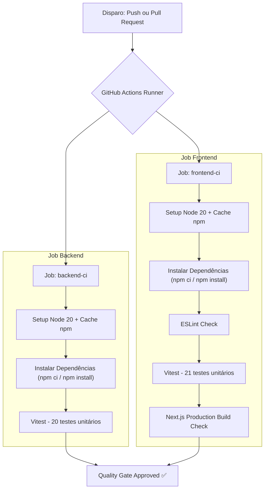

# ⚙️ Pipeline de CI/CD — Documentação Técnica

> Este documento descreve a arquitetura da esteira de Integração Contínua (CI) e Entrega Contínua (CD) do projeto NeoGenomica, abrangendo a estratégia de defesa em duas camadas: **Pre-commit local**, **GitHub Actions na nuvem** e **Containerização com Docker**.

---

## 📑 Índice

1. [Visão Geral da Arquitetura](#1-visão-geral-da-arquitetura)
2. [Estratégia de Defesa em Duas Camadas](#2-estratégia-de-defesa-em-duas-camadas)
3. [Camada 1 — Client-Side (Git Pre-Commit Hooks)](#3-camada-1--client-side-git-pre-commit-hooks)
4. [Camada 2 — Server-Side (GitHub Actions CI Pipeline)](#4-camada-2--server-side-github-actions-ci-pipeline)
5. [Especificação do Workflow YAML (`.github/workflows/ci.yaml`)](#5-especificação-do-workflow-yaml-githubworkflowsciyaml)

---

## 1. Visão Geral da Arquitetura

A automação de qualidade e integração contínua (CI/CD) foi projetada para garantir que nenhum código quebrado, sem tipagem ou com regressão técnica seja integrado à branch principal (`main`).

```
[Desenvolvedor Local] ──(Pre-commit)──> [Git Commit] ──(Push / PR)──> [GitHub Actions CI (Nuvem)] ──(Pass)──> [Merge main]
```

---

## 2. Estratégia de Defesa em Duas Camadas

Para aliar **rapidez no desenvolvimento local** com **segurança inegociável no repositório remoto**, a aplicação implementa duas camadas de verificação:

| Camada | Ferramenta | Onde Roda | Objetivo |
|---|---|---|---|
| **1. Client-Side** | `pre-commit` hooks | Máquina do Desenvolvedor | Feedback ultrarrápido antes do commit (Shift-Left Testing). |
| **2. Server-Side** | GitHub Actions Workflow | Container `ubuntu-latest` (Nuvem) | Trava obrigatória de validação em ambiente limpo e isolado. |

---

## 3. Camada 1 — Client-Side (Git Pre-Commit Hooks)

A ferramenta `pre-commit` intercepta o comando `git commit` localmente e executa 7 verificações automáticas definidas em `.pre-commit-config.yaml`:

1. **Check YAML**: Valida a sintaxe de arquivos `.yaml` e `.yml`.
2. **Check JSON**: Valida a sintaxe de arquivos `.json`.
3. **Fix End of Files**: Garante que os arquivos terminem com uma linha em branco.
4. **Trim Trailing Whitespace**: Remove espaços em branco desnecessários no final das linhas.
5. **Backend Unit Tests**: Executa os 20 testes unitários do backend (`Vitest`).
6. **Frontend Unit Tests**: Executa os 21 testes unitários do frontend (`Vitest + RTL`).
7. **Frontend ESLint**: Executa a análise estática de código no Next.js.

```bash
# Execução manual de todas as checagens
pre-commit run --all-files
```

---

## 4. Camada 2 — Server-Side (GitHub Actions CI Pipeline)

Mesmo que um desenvolvedor utilize a flag `git commit --no-verify` para pular as travas locais, o **GitHub Actions** atua como o portão de segurança remoto.

O arquivo de configuração está localizado em [`.github/workflows/ci.yaml`](../.github/workflows/ci.yaml) e é acionado automaticamente em duas situações:
- **`push`**: Em branches `main` e `develop`.
- **`pull_request`**: Direcionados a `main` e `develop`.

---

## 5. Especificação do Workflow YAML (`.github/workflows/ci.yaml`)

O workflow é composto por **2 Jobs paralelos**:



### Detalhamento dos Jobs

#### ⚙️ Job `backend-ci`
- **Runner**: `ubuntu-latest`
- **Diretório de Trabalho**: `./backend`
- **Passos**:
  1. `actions/checkout@v4`: Baixa o código do repositório.
  2. `actions/setup-node@v4`: Configura o Node.js v20 com cache no `backend/package-lock.json`.
  3. `npm ci || npm install`: Instala dependências com fallback resiliente entre SOs (Windows vs Linux).
  4. `npm test`: Executa a suíte de 20 testes unitários da API REST em ambiente simulado.

#### 🖥️ Job `frontend-ci`
- **Runner**: `ubuntu-latest`
- **Diretório de Trabalho**: `./frontend/devtest-frontend`
- **Passos**:
  1. `actions/checkout@v4`: Baixa o código.
  2. `actions/setup-node@v4`: Configura Node.js v20 com cache no `frontend/devtest-frontend/package-lock.json`.
  3. `npm ci || npm install`: Instala dependências com fallback resiliente.
  4. `npm run lint`: Valida regras de código do ESLint 9 para React 19 / Next.js 16.
  5. `npm test`: Executa 21 testes unitários dos componentes e serviços com Vitest e React Testing Library.
  6. `npm run build`: Executa o build de produção (`next build`) para verificar se não há erros de compilação ou incompatibilidades de SSR/Hydration.

*Documentação gerada em: 2026-08-12 — Pipeline CI/CD & Docker v1.1.0*
